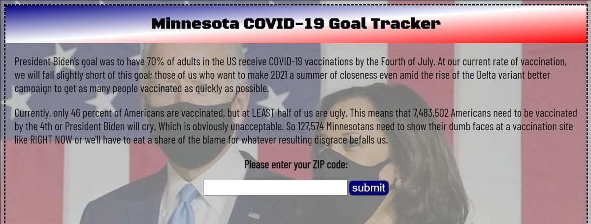
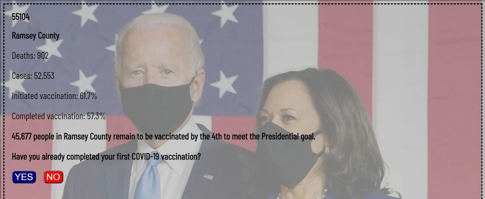
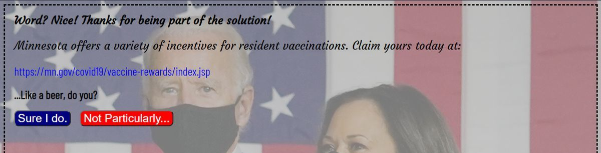
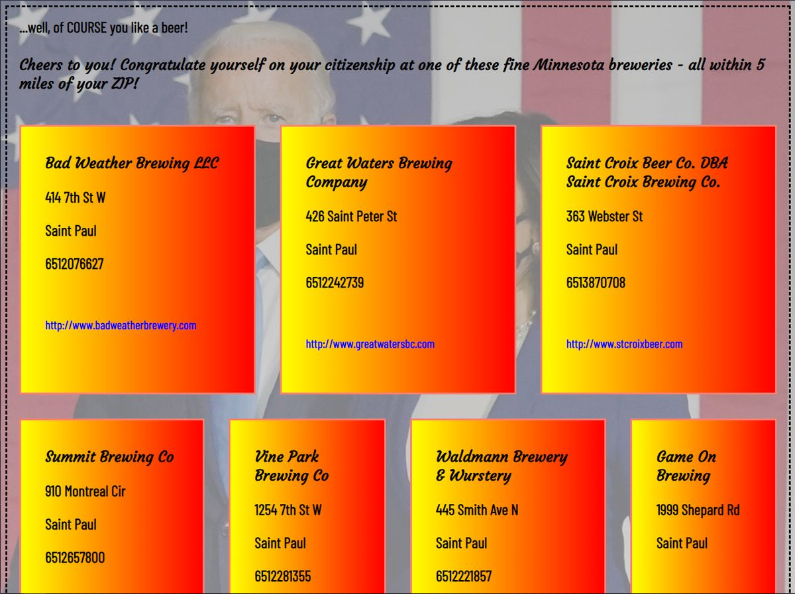
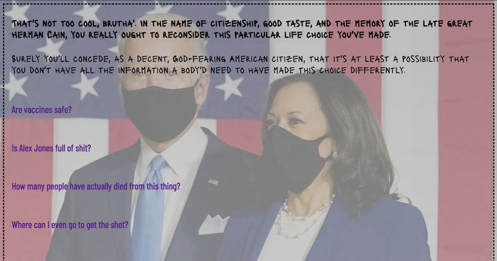

# Group Project 1 - COVID-19 Goal Track

## Description
This is a web application that attempts to positively affect the American public's progress in attaining President Biden's goal of 70% of the nation vaccinated before the Fourth of July. It shows the user local vaccination information at the county level upon entering their zip code. On the page that follows, the user is asked whether they've initiated their own vaccination already or not and are rewarded with offers and locality-specific treats or directed to a vaccination location resource depending upon their answer. It may already be quite close to the goal's deadline but this is America and we don't quit. Even when the chips are down.

## Screenshots

---

---

---

---

Check out the [deployed web page](https://JChosay.github.io/group-pj1-covid-goal-track/)